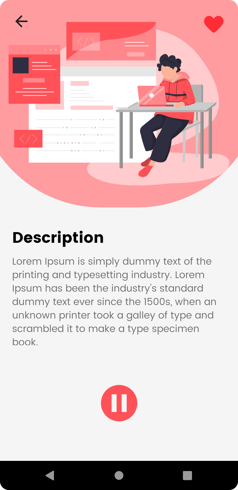
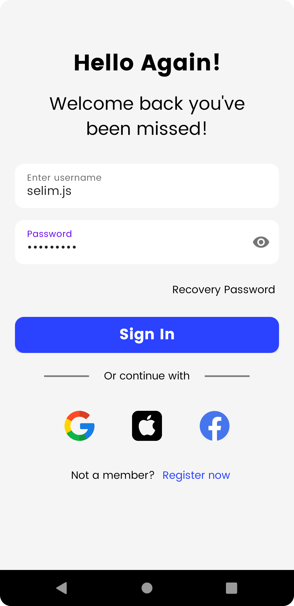
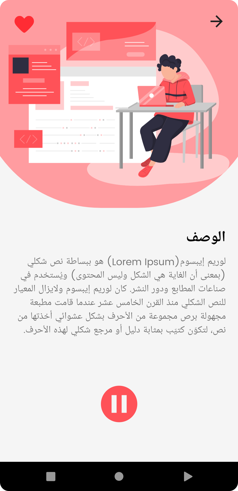
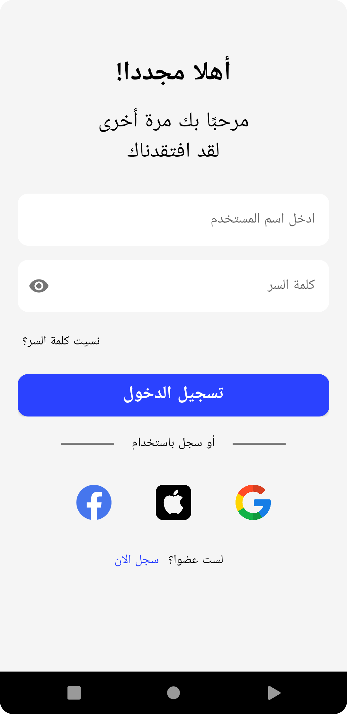

# **Gmind Native App**

## **Sign in and Description screens**
- [Screens outputs](#screens)
- [Gradle](#gradle)

### **Screens**
| Description (En) | Login (En) |
|:----------------:|:----------:|
|  |  |

| Description (Ar) | Login (Ar) |
|:----------------:|:----------:|
|  |  |

### **Gradle**
Enable screen binding by adding to **build.gradle**
```
buildFeatures {
        viewBinding true
}
``` 